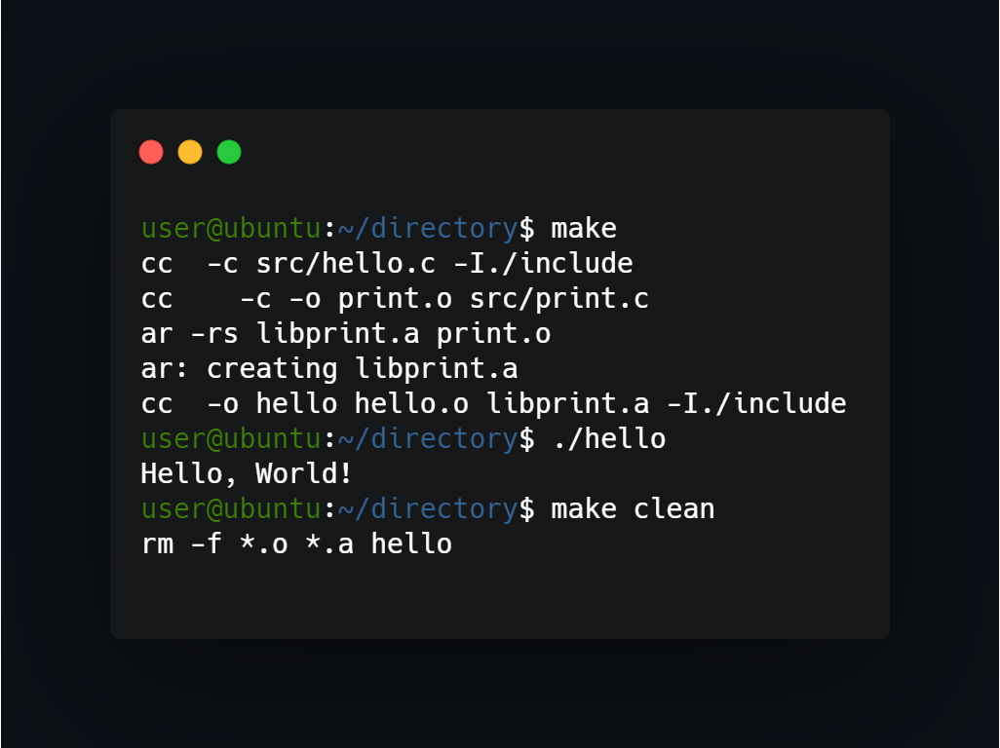

## What project do?
___
Simple 'hello world' C program that shows basics using Make to compile and manage program. Using Makefile you can compile and remove compiled files to original state.

## How to install and run?
___
To install program run 'make' from terminal and program with all it's libraries will compile itself. Then you can execute "hello" file generated by Makefile `./hello`. 

## How to uninstall?
___
To uninstall just run `make clean` - this removes compiled instances and leaves original code.

<!--https://banner.godori.dev/ height:150-->
<!--https://shields.io/-->
<!--https://carbon.now.sh/-->